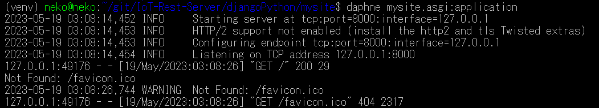
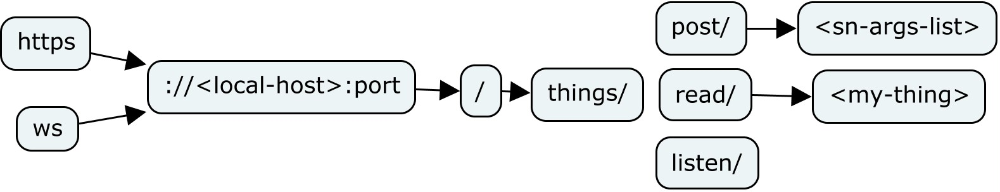
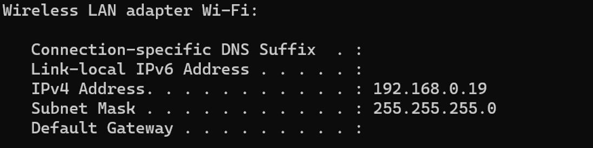

#   IoT Server Framework Proposal
Django server for IoT-based data transmission infrastructure proporsal 

----------
# Table of Contents
## 1. [Installation](#installation)
## 2. [User Guide](#user-guide)
## 3. [LAN Support](#lan-support)
## 4. [Wiki](#wiki)

----------

## Installation
First install [python](https://www.python.org/downloads/) from the official site, anything above the 3rd version should work just fine. Make sure to be running the correct version of python when doing commands, to check this call the 'python --version' command in the command line. If a lower version is prompted, try running the 'python3 --version' command, in such case do all the following python-related commands with 'python3' instead.

Once python is installed navigate or create the directory where you want the project to be stored. Once in that directory clone or download the latest zip/tar from [releases](https://github.com/M4CH1N3G1RL/IoT-Rest-Server/releases).

Navigate to the project directory up to the level where this README.md file is stored, we will be refering to this loocation as the root directory from now on.

Once in the root directory, activate the python virtual environment running the following command
```shell
python3 -m venv venv
```
Activate the virtual environment by executing the activate.bat file '.\venv\Scripts\Activate.bat' (Windows). If working in Linux, source the 'activate' file 'source venv/bin/activate'

Once the virtual environment is activated the main command line pront should be prefixed by a '(venv)' quote and all the python-related commands will be executed by the activated environment. 

Install the required packages using pip from the 'requirements.txt' file using the following command:
```shell
pip install -r requirements.txt
```
<p style="text-align: center;">



</p>
Note that if you are installing from a *nix plataform you will get an error about the twisted-iocpsupport package, since linux supports epoll you shall ignore this message and continue with the installation. 

You are now ready to run the server using daphne, navite to 'djangoPython/mysite/' directory where 'manage.py' lives. This is the server's main directory were all the deployment commands should be executed.

To start the server run:
```shell
daphne mysite.asgi:application
```
<p style="text-align: center;">


</p>
 
Use any web browser at your local host to see the running server, to do this navigate to 'http://127.0.0.1:8000/'

## User Guide
The server currently gives the user three services to interact with defined by the path in the URL, these services are posting (http), reading (http), and listening (ws), and have the following URL syntax

<p style="text-align: center;">



</p>

### To-Post
The server's posting services consist of sending https requests with some arguments using the URL query args, these arguments are then parsed by the server uppon arrival and dumped into the sqlite database, to do this use the following URL, you can put it in any browser while the server is running in the background 
```
http://127.0.0.1:8000/things/post/myThing?s0=0&s1=1&s2=2&s3=3&s4=4&s5=5&s6=6
```
### To-Read
Now that you have successfully posted your thing into the server you might want to take a look at it and retrieve the data you or someone else stored, to do this use the following URL, again any browser is capable of sending this request
```
http://127.0.0.1:8000/things/read/myThing
```
### To-Listen
You might want to keep a continuous conection insead of havinf to check out the value iteratively, to do this we can use the listen service, in contrast with the previous URLs, this one cannot be used directly with a web browser, you can use the rusty [websocat](https://github.com/vi/websocat) tool in a linux platform or the third-party site [websocketking](https://websocketking.com/) to stablish such cool connection, once your chosen tool is ready input the following URL
```
ws://127.0.0.1:8000/myThing
```
## LAN Support
Django by default is configured to deploy a 'development' version of the server with the DEBUG flag, enabling and disabling a bunch of things. When this testing version activated the server will begin in the following socket: starting server host at 'localhost' and port=8000. The fact that the server host deploys within localhost will not allow for other devices to access the machine over LAN. This concept is called [loopback](https://en.wikipedia.org/wiki/Localhost), which is an abstraction made by the OS so the computer can send IP packets to itself without requiring any actual physical Network Interface Controller. 

To disable this development version, navigate to the main settings.py and set the DEBUG variable to False, also set the variable ALLOWED_HOSTS = ['*'], this is rather insecure, so be careful when using it at bigger networks.

Now that the server is no longer in dev mode, run daphne in the desired port and address with the -b and -p flag respectively. 
 
```bash
daphne -b 0.0.0.0  -p 8000  mysite.asgi:application 
```
Once again the '0.0.0.0' address is an special address which allows the server to be able to host into the machine's Network Interfaces IP, this is done because due to DHCP some IPs arent static, instead of checking everytime for the updated IP, [this host in this network](https://en.wikipedia.org/wiki/0.0.0.0) can be wildcarded' as 0.0.0.0 

Now that the server is running at this address, to access it from other devices just replace the machines' ip in the URL requests. To find out what is the ip of the machine use the ipconfig command in windows or ifconfig in Linux:
```bash
ipconfig 
```
This command will give you the info from all Network Interfaces. Just search for the IPv4 Wi-Fi adapter address



Once the destination IP and destination port are known, the URL request for posting to the previous local server example would look as the following

```
http://192.168.0.19:8000/things/post/myThing?s0=0&s1=1&s2=2&s3=3&s4=4&s5=5&s6=6
```
Which again, can be requested by any device in the same network that support such high-layer protocols

## Wiki
Model-Base design that involves specialized dynamics characterized by completely different sources varying from simulated to experimental, demands a strong infrastructure capable of adapting to all of the different requirements throughout the different stages of the design cycle. This proyect aims to propose the foundations of an IoT-based infrastructure which deals with the data transmission in a modular-fashioned and flexible way to deal with the adaptability required to keep up with the changing environment. [Django](https://www.djangoproject.com/) was used due to the nearly OS-agnostic characteristics of python (and all of the useful resources of course)

#### Characteristics
Among the different requirements needed to propose such infrastructure, three main characteriztics were aimed for:
- State Monitoring
- State Posting/Listening
- http // ws support

###  Definitions
***Element*** - Small processig unit/computer composed of I/O interfaces, sensors, transduscers, etc. It can also be defined as the client from the Server's Perspective. It is assumed that an element communicates wirelessly, or at least is able to communicate to an Access Point. An element is the definitive source of data, the eyes of the IoT environment.

***Server*** - Also refered to as the Cloud, It is the main Processing Unit with a bunch of responsibilities: Orchestrates the communication between elements, acts as a gateway allowing compatibility between different protocols, saves data to the database, runs complex algorithms, outputs data to the elements, among others. Shall we not forget that the server is just a process running in some good-spec'ed computer.

###  Django Framework
The general Django framework involves  managing http requests, migrating databases changes using the models abstraction layer via python, and building modular apps, which can be portable to other Django / Restful projects. All the server logics were build around these abstraction layers.

<p style="text-align: center;">


</p>
