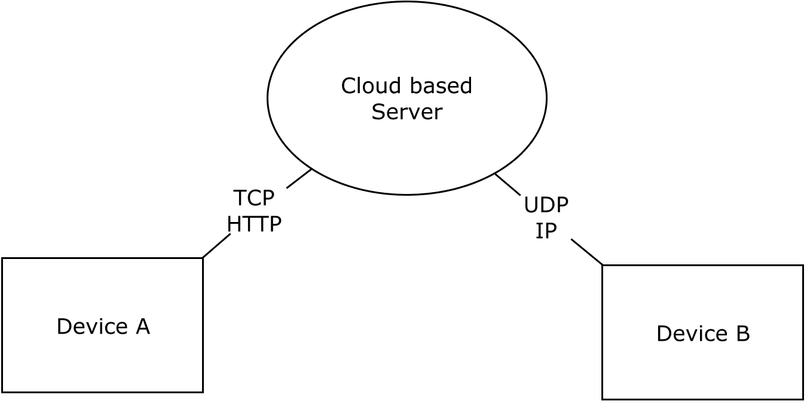
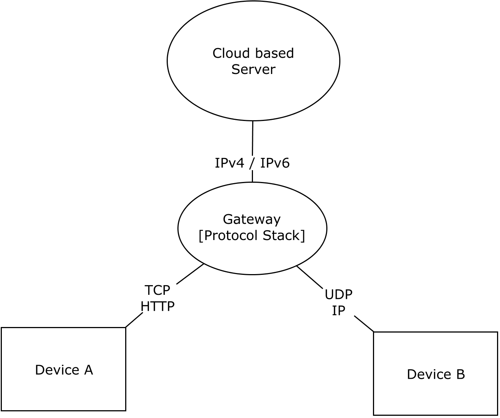
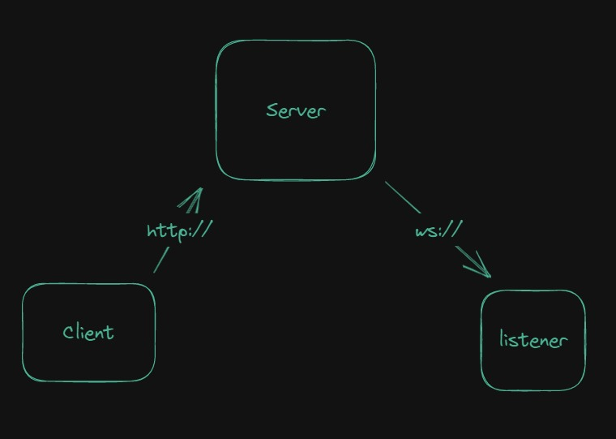

#   IoT Server Framework Proposal
----------
[General Description]

##  Objectives

 - As an implementations User
    - Send data via https to the Server/Cloud for later use or post-processing
    - 

 - As a Design User
    - Use it for design yo
    -

### Characteristics

- State Monitoring
- State Posting/Listening
- http // ws support

##  Definitions
***Element*** - Small processig unit/computer composed of I/O interfaces, sensors, transduscers, etc. It can also be defined as the client from the Server's Perspective. It is assumed that an element communicates wirelessly, or at least is able to communicate to an Access Point. An element is the definitive source of data, the eyes of the IoT environment.

***Server*** - Also refered to as the Cloud, It is the main Processing Unit with a bunch of responsibilities: Orchestrates the communication between elements, acts as a gateway allowing compatibility between different protocols, saves data to the database, runs complex algorithms, outputs data to the elements, among others. Shall we not forget that the server is just a process running in some good-spec'ed computer.

##  US

- As an implementation dude, I want to be able to communicate an element wirelessly to a main Processing Unit, so I can process the data independently from the source of origin.
- As a designer, I want to retrieve an element data from a database 

IoT Server Framework Proposal

##  General

Placeholder

### Frame Structure

The frame is implemented by a python dictionary which is later "dumped" to a json format for further compatibility.

[describe frame]

#   User Guide
[Put a nice user guide here]

#   Test Zone
> something 
>> something2
>>> something3

something

